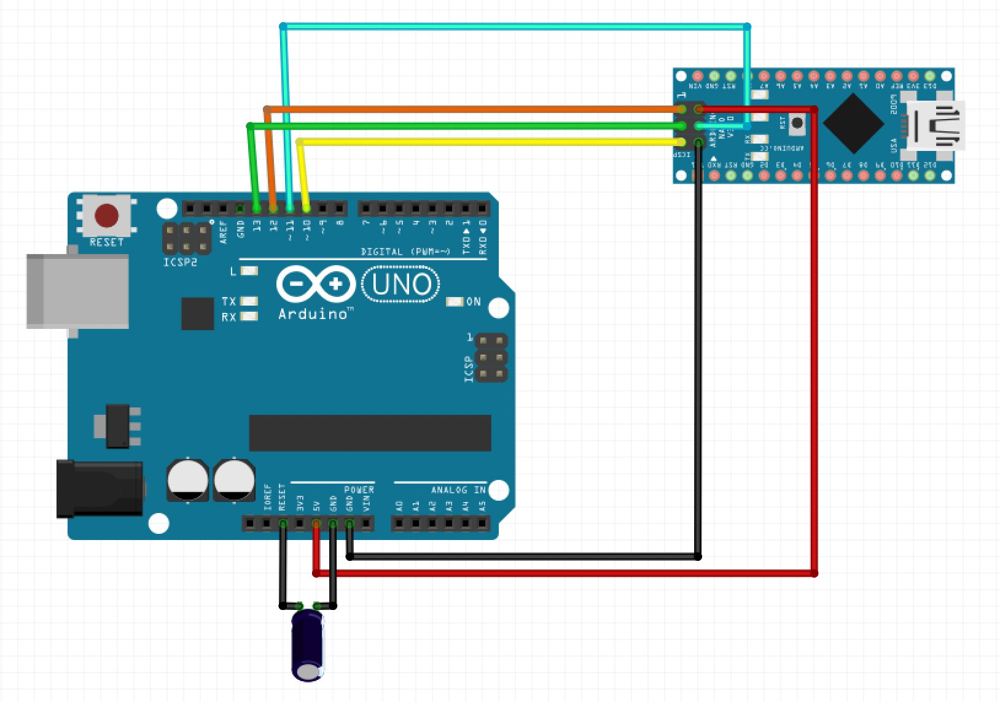
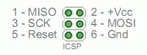
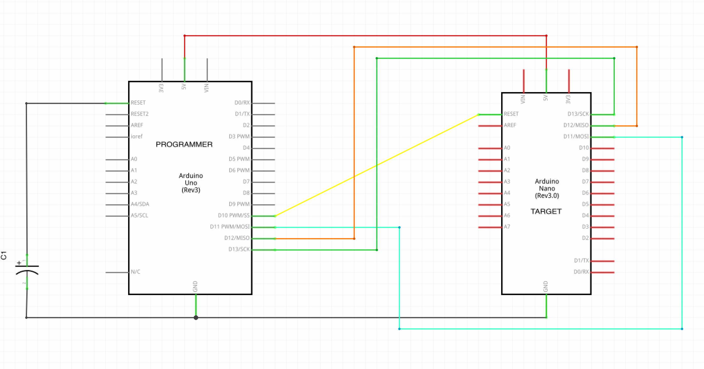

# flash-nano-with-uno

## Links

[Arduino: How to burn the bootloader in an Arduino Nano using an Arduino UNO](https://support.arduino.cc/hc/en-us/articles/360012048100-How-to-burn-the-bootloader-in-an-Arduino-Nano-using-an-Arduino-UNOà)

## How to burn the bootloader in an Arduino Nano using an Arduino UNO

The bootloader is a piece of code that is stored in a reserved space of the memory of your Arduino board. Basically, this code initiates the sketch as soon as the board is powered on and also allows new sketches to be uploaded from the PC.

It can happen that this piece of code gets corrupted when attempting to upload a bad sketch, applying too high/low voltage to I/O pins or power inputs. If this is the case, the board will not be detected by your PC any more and the port will show greyed out on Arduino IDE.

If by chance you happen to have an Arduino UNO and 6 jumper wires you can easily reprogram your Arduino NANO using your UNO board as a programmer. Just need to upload ‘Arduino ISP’ sketch, connect the boards and click ‘Burn Bootloader’.

All you need to perform this operation is: a programmer board (Arduino UNO), 6 jumper wires (please note jumpers need to be ‘male’ on one end and ‘female’ on the other end), PC with Arduino IDE installed, and your Arduino NANO.

Detailed instructions below:

1. Upload the ArduinoISP sketch to the Arduino UNO:

Find the sketch in Arduino IDE top menu: `File > Examples > 11.Arduino ISP > ‘ArduinoISP’`. Then disconnect the Arduino UNO board from the PC.

2. Connect the boards as follows:

:warning: Please note the connections are made between Arduino UNO I/O pins and Arduino NANO ICSP connector. This connector has 6 pins that are arranged as the diagram shows (placing the NANO board with ICSP connector facing up leaving the USB port on the right side).

|PROGRAMMER  (I/O PINS)	| TARGET  (ICSP) |
|---|---|
| PIN 10 | ICSP 5 |
| PIN 11 | ICSP 4 |
| PIN 12 | ICSP 1 |
| PIN 13 | ICSP 3 |
| 5V | ICSP 2 |
| GND | ICSP 6 |

3. Schema

4. Connect Arduino UNO back to your PC via USB.
5. When choosing the port and board, this time you need to select `Tools > Programmer > Arduino as ISP.`
6. Click on: `Tools > Burn Bootloader`
7. 